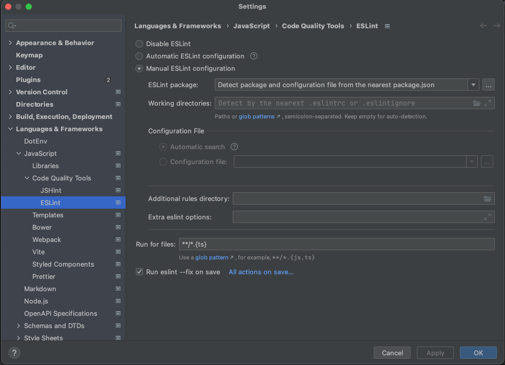

# TODO
- Pre commit Eslint
- Pre commit Prettier


# Groupon Serverless Core Project 

## (A) About Server Less and why we are pushing it
A **serverless application** is a software architecture in which the backend services, including servers, storage,
and databases, are managed by a cloud provider. The developer writes the application code, 
and the cloud provider handles server provisioning, scaling, and maintenance. This allows developers to focus 
solely on coding and business logic without worrying about infrastructure management. Serverless apps are often 
event-driven and utilize "Functions as a Service" (FaaS) and automatically scale based on demand.


## (A.1) Why Serverless is Better than Microservices:

- **Serverless** allows developers to focus on functionality rather than infrastructure, which leads to a faster release cycle compared to setting up and managing a microservices architecture.

- **Serverless** abstracts away the server management, while microservices still require managing container orchestration and deployment.

- **Serverless** is generally more cost-efficient since you only pay for actual usage, whereas microservices may require paying for always-running infrastructure.

- **Serverless** platforms automatically scale in response to demand, which simplifies scalability management compared to microservices, where scaling requires careful handling of multiple components.

## (A.2) Why Mono Repo is Better than Multiple Git Repositories:
- **A mono repo** approach ensures that all code is stored in one repository, which makes it easier to maintain consistency across different parts of a project and helps reduce version conflicts.
- **Simplified Dependency Management:** With a mono repo, managing dependencies across projects is easier, allowing for shared libraries and reducing redundancy compared to multiple repositories.
- **Cross-Team Collaboration:** A mono repo can improve collaboration between teams working on interconnected components, as they all have access to the same codebase, reducing integration issues.
- **Streamlined CI/CD:** Mono repos enable unified continuous integration and deployment (CI/CD) pipelines, making the build and release process more efficient across different components and reducing complexity compared to managing multiple pipelines.

## (B) Architectural Concept
- **Zero Groupon Dependencies**
  - This repository has no Groupon libraries that require special access or care. 
  - There is no external dependency for any proprietary system that the developer would have to deal with.
- **Simplified SOX policy according US Policy"** **
  - Core idea and Movement is Bringing IT back to the correct use of SOX policy and removing obstacles that were mistaken for SOX.
  - Remove SOX from the repository and move SOX to Deployment with transparent and auditable records with pure Role base access control. 
  - Moving SOX policy into and deleting three repositories (Production, Developer and Secrets) for every microservice (10.000) github groupon repositories.
- **RoleBase All Engineering covering system for Permissions on Deployment and Secrets**
  - Moving SOX policy and deleting three repositories (Production, Developer and Secrets) to scalable up-to-date policy with GCP Secrets Management.
- **Zero proprietary Computer settings**
  - Developers should be able to set up their environment without relying on proprietary configurations. 
  - This ensures flexibility and eliminates dependencies that could cause compatibility issues.
- **15 minutes Developer onboarding**
  - Aim for a smooth and rapid onboarding process that allows new developers to become productive within 15 minutes. 
  - This minimizes downtime and speeds up integration into the team.
- **Automatic API generation**
  - Developer can't write an api that does not have an automatically generated and tracked documentation
  - Developers do not write documentation manually, but it is created automatically with each build and relase.
- **Zero manual API integration**
  - Automate API integration not via OpenApi as Legacy technology, where developer must read swagger, but directly via generated typescript code with type protection and all features from  native code. 
  - Generated code as "library" and not as "OpenApi" json to reduce errors and save development time. 
    - OpenApi will be automatically supported but for Legacy stack
  - Manual integration is prone to mistakes and slows down the development process.
- **No Boilerplate code**
  - Avoid repetitive and redundant code we have server-less architecture with services support and independent libraries.
  - Whole project and is Mono-Repo server-less framework in native form. This helps developers focus on writing unique logic and reduces maintenance overhead.
- **Smallest size for migration or Develop**
  - Minimize the size and complexity of migration tasks to make transitions smoother and less error-prone. Thats Why you can rewrite legacy microservices into Server-less method (api) one by one. Smaller migration chunks are easier to test and validate.
- **Libraries designed for large scale and long term support**
  - Key libraries have default settings that prevent incomplete integration. For example, runtime logging and user activity logging, where the library itself ensures that historical data is cleaned unless the developer sets a stricter policy.
- **Whole Documentation in CODE**
  - No more JiraConfluence. All documentation is tracked in Repository.
  - Embed all relevant documentation directly within the code to ensure it’s always up-to-date. 
  - This reduces the need for external documents and makes it easier for developers to understand and maintain the code.
  - The code is versioned, so the **documentation is also versioned**.
- **Strict Development & Code quality Policy**
  - Enforce rigorous code quality standards and development practices to maintain high-quality output. 
  - Consistent policies ensure that code is reliable, maintainable, and scalable.
  - Code Quality and code standard is explained on separate Docu
- **Principal Engineer as ServerLess Architect & owner**
  - We have dedicated person responsible for "maintenance", code quality, standardization, libraries conditions and basic architecture concept. 
  - The responsibility of the Principal Engineer is:
    - to write the tutorials, take care of the documentation, 
    - train developers and EMs,
    - seek improvements and simplifications and new technologies and acquire them,
    - force developers to write quality code, 
    - check the quality of the code regularly, refactor the code, 
    - keep all libraries up to date, 
    - update the entire system on a weekly basis so that it never starts to age
- **AI Every build validation**
  - AI reviews code and creates ratings, watches for anomalies and poor quality code. AI results are recorded in statistics
- **Kindly Reminder full Integration**
  - Kindly Reminder generates tasks for developers about code quality, not accepted Merch requests, refused Pull requests, 
- **Checking branches that never returned to master**
  - Huge amounts of code and development that have gone nowhere or have been abandoned, causing a highly confusing state of affairs.
  - Therefore, the system will automatically escalate them via Kindly Reminder or delete them.


## <font color="#00a828">Be Developer in Groupon - First Day Phase (1 Day step)</font>
1) You need access to JIRA as Developer () in [Groupon Jira](https://groupondev.atlassian.net/)
2) For interconnection to other systems (API) you need "Groupon Developer VPN" (<font color="#ff0000">TODO Docu</font>)
3) Read code writing standards, conventions and rules deeply. (<font color="#ff0000">TODO Docu Link</font>)
   1) You know why? 
      1) BECAUSE there is a system that tracks all the code you create and produces a quarterly evaluation of your work. 
      2) The cleanliness of the code, the amount of comments. Proper type protection.
      3) All of which the AI knows how to score.
4) Set your IDE (Webstorm)
   1) Plugins to Install 
      1) Grazie pro: [link](https://plugins.jetbrains.com/plugin/16136-grazie-pro)
      2) Database Tools and SQL for WebStorm [link](https://plugins.jetbrains.com/plugin/10925-database-tools-and-sql-for-webstorm)
   2) Set Webstorm properly
      1) To write clean and clear code, we use Eslit. We check your code before you save it and before you make a Marge request. To see what's wrong in the IDE, set up Eslint according to the project rules (not the IDE default). 
      2) Read how to set Eslint version 9 and later Webstorm in [webstorm config](https://www.jetbrains.com/help/webstorm/eslint.html#ws_js_eslint_activate) or set up your IDE exactly as shown on next picture.
      3) 

## <font color="#00a828">Developing locally - Preparation Phase  (5 minutes step)</font>

1) Install node.js (version 21.7.3 minimal)
   1) In terminal you can check it by <font color="#fd8000">$ npm -v</font>
2) Install npm (version 10.5.0)
   1) In terminal you can check it by <font color="#fd8000">$ node -v</font>
3) Install Encore Library (tutorial - https://encore.dev/docs/install)
   1) Mac: <font color="#fd8000">$ brew install encoredev/tap/encore</font>
   1) Windows: <font color="#fd8000">$ iwr https://encore.dev/install.ps1 | iex</font>
   2) -> Update: <font color="#fd8000">$ encore version update</font>
4) Log into Encore (https://app.encore.dev/) with Groupon Email (or Ask @Tomas Zaruba for Membership)
5) Auth your encore: <font color="#fd8000">$ encore auth</font>. This will open a browser where you can authorize yourself thanks to the login from the previous step. A security key like SSH (with limited time validity) will be saved to your computer. From now on, Encore knows it's you and all your development activities are recorded. (Every build, every code update)


---

## <font color="#00a828">Run Serverless - Preparation Phase  (10 seconds step)</font>

```bash
encore run
```

While `encore run` is running, open <http://localhost:9400/> to view Encore's [local developer dashboard](https://encore.dev/docs/observability/dev-dash).

-> Yes - thats it! <3


## Testing

```bash
encore test
```


